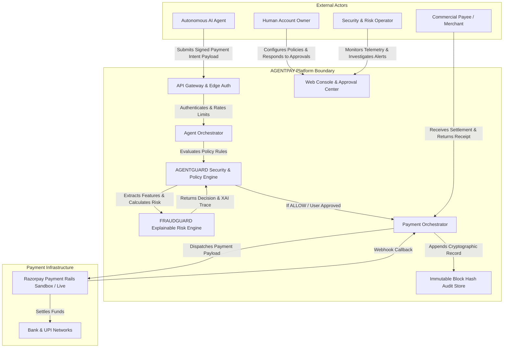

# AGENTPAY — 01: System Context Architecture Specification

## 1. Executive Overview

This document specifies the **System Context Architecture** for AGENTPAY, AGENTGUARD, and FRAUDGUARD. It defines external system actors, boundary interfaces, input/output data flows, and trust touchpoints.

---

## 2. System Context Diagram

---

## 3. Actor & Interface Specifications

### 3.1 Human Account Owner (`USER`)
* **Interface**: HTTPS / Web Dashboard & Mobile Approval App (`Layer 1`).
* **Protocol**: TLS 1.3 / REST API / WebSockets.
* **Capabilities**: Policy configuration, MFA session management, one-click escalation approvals/rejections, Emergency Stop kill switch execution.

### 3.2 Autonomous AI Agent (`AI AGENT`)
* **Interface**: RESTful Agent Gateway API (`POST /api/v1/payment-intents`).
* **Protocol**: TLS 1.3 / HMAC-SHA256 Signed HTTP Headers.
* **Capabilities**: Submitting structured `PAYMENT INTENT` payloads, querying intent statuses, receiving webhook decision callbacks.

### 3.3 Payment Gateway Infrastructure (`RAZORPAY`)
* **Interface**: Razorpay API Sandbox / Live Settlement Gateway.
* **Protocol**: RESTful API / HMAC Webhook Callbacks (`payment.captured`, `payment.failed`).
* **Capabilities**: Processing card/UPI settlements, issuing order tokens, returning transaction fulfillment signals.
