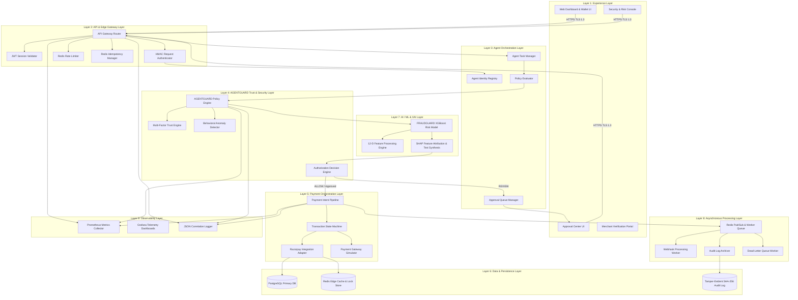

# AGENTPAY — 02: High-Level System Architecture (9 Logical Layers)

## 1. Architectural Blueprint

AGENTPAY is architected across nine logical layers, providing clean separation of concerns between user experience, edge security, policy enforcement, AI risk intelligence, payment orchestration, and immutable auditability.

---

## 2. Operating Modes

### Mode 1: Human-Assisted Commerce
User initiates intent via web console; system executes policy and risk checks; if compliant, payment is routed to Razorpay checkout rails with human approval verification.

### Mode 2: Autonomous Agent Commerce
Autonomous AI AGENT initiates intent via API using HMAC credentials. AGENTGUARD evaluates 6-stage policy rules; FRAUDGUARD computes risk score (0-100) and XAI trace. If safe ($\le$ auto-approval limit and low risk), payment executes autonomously without human friction. If uncertain or high risk, payment is held in `PENDING_APPROVAL` status and pushed to the human user's Approval Center.
