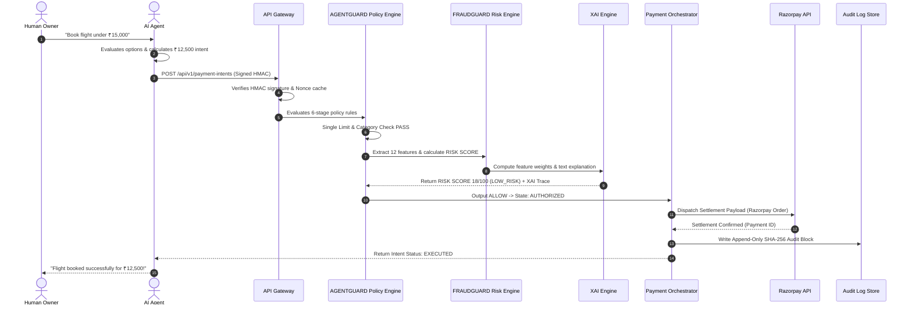

# AGENTPAY — 04: AGENTPAY Core Autonomous Agent Commerce Architecture

## 1. Overview

This document specifies the core autonomous agent commerce workflow within AGENTPAY. It details how an AI agent discovers goods/services, constructs a structured payment intent, passes policy and risk gates, and completes payment settlement.

---

## 2. Agent Execution Sequence Diagram

---

## 3. Core Workflow Stages

1. **Intent Understanding & Planning**: AI AGENT parses user task, identifies product/service, and constructs intent payload (`amount`, `category`, `merchant`, `idempotency_key`).
2. **Cryptographic Intent Submission**: AI AGENT signs payload using `secret_key` and POSTs to `/api/v1/payment-intents`.
3. **Gateway Ingestion & Validation**: Gateway verifies HMAC signature, timestamp window, and idempotency lock in Redis.
4. **AGENTGUARD Policy Gate**: Policy engine evaluates single limits, daily budgets, category rules, and auto-approval thresholds.
5. **FRAUDGUARD Risk & XAI Gate**: Risk engine computes 12 risk features, calculates RISK SCORE (0-100), and generates SHAP feature weights + natural text summary.
6. **Authorization Decisioning**:
   * If `ALLOW`: State set to `AUTHORIZED`; forwarded to Payment Orchestrator.
   * If `REVIEW`: State set to `PENDING_APPROVAL`; escalated to Approval Center UI.
   * If `BLOCK`: State set to `BLOCKED`; terminated immediately; security alert emitted.
7. **Settlement & Audit**: Payment Orchestrator executes Razorpay adapter, verifies settlement response, appends SHA-256 block hash audit log entry, and notifies agent.
