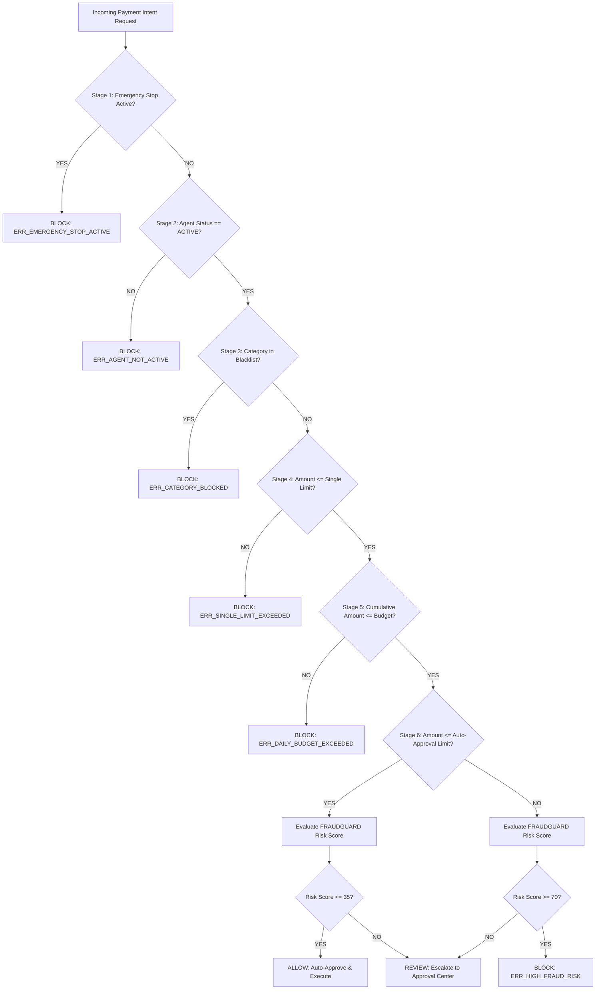

# AGENTPAY — 05: AGENTGUARD Security Control Plane Architecture

## 1. Architectural Independence & Mandate

**AGENTGUARD** acts as an architecturally independent security control plane operating between AI AGENT logic and payment execution rails. Even if an AI agent's internal LLM planner decides to proceed with a purchase intent, AGENTGUARD possesses complete deterministic authority to override, challenge, or block the transaction.

---

## 2. AGENTGUARD Precedence Evaluation Flow



---

## 3. Decision Trace Schema

Every decision rendered by AGENTGUARD produces a standardized structured payload:

```json
{
  "decision_id": "dec_9f8a7b6c-5d4e-3f2a",
  "transaction_id": "intent_7f8a9b0c-1d2e-3f4a",
  "agent_id": "agt_8f9b2c3a-4e1d-4a5b",
  "risk_score": 18,
  "risk_level": "LOW_RISK",
  "policy_result": "PASS",
  "triggered_rules": ["RULE_SINGLE_LIMIT_PASS", "RULE_MCC_ALLOWED"],
  "model_version": "fraudguard_xgb_v1.4.2",
  "explanation": "Transaction APPROVED. Amount (₹2,500) is within auto-approval threshold ₹5,000. Category 'Electronics' is allowed.",
  "timestamp": "2026-08-24T21:15:00Z",
  "decision_latency_ms": 12.4
}
```
