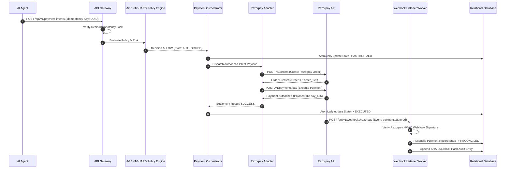

# AGENTPAY — 06: Payment Orchestration & Razorpay Gateway Boundary Architecture

## 1. Architectural Boundary & Decoupling

To prevent vendor lock-in and decouple core domain business logic from specific payment providers, AGENTPAY implements a **Payment Orchestrator Boundary**. Core intent processing interacts exclusively with an abstract Payment Adapter Interface.



---

## 2. Adapter Protocol Interface

The Payment Orchestrator communicates with payment providers via a strict TypeScript interface:

```typescript
export interface IPaymentAdapter {
  createOrder(intent: PaymentIntent): Promise<RazorpayOrderResult>;
  executePayment(orderId: string, payload: SettlementPayload): Promise<SettlementResult>;
  verifyWebhookSignature(payload: string, signature: string, secret: string): boolean;
  cancelIntent(intentId: string): Promise<CancellationResult>;
}
```
