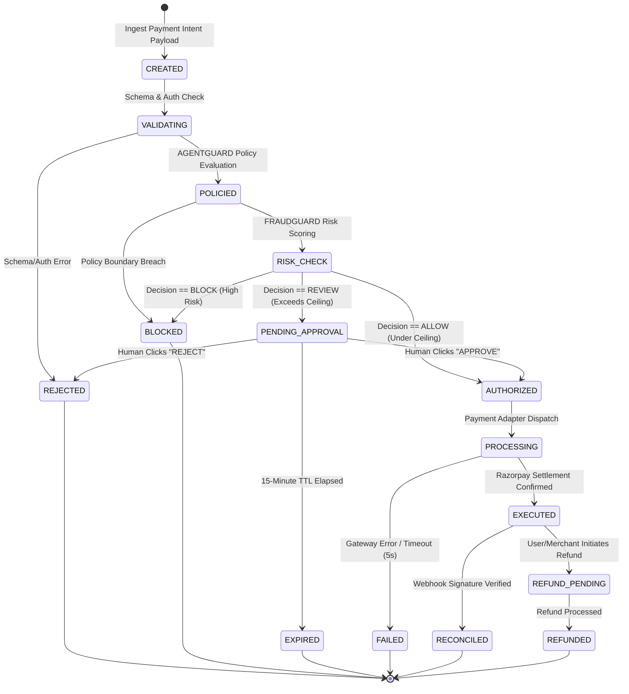

# AGENTPAY — 07: 14-State Transaction State Machine Specification

## 1. State Machine Diagram

Every financial intent in AGENTPAY transitions through an atomic 14-state transaction lifecycle.

---

## 2. Transition Rules & Preconditions

| State | Legal Target States | Required Condition | Atomic DB Operation |
| :--- | :--- | :--- | :--- |
| `CREATED` | `VALIDATING` | Schema validation succeeds | `UPDATE state = 'VALIDATING'` |
| `VALIDATING` | `POLICIED`, `REJECTED` | AGENTGUARD policy check complete | `UPDATE state = 'POLICIED'` |
| `POLICIED` | `RISK_CHECK`, `BLOCKED` | Feature extraction complete | `UPDATE state = 'RISK_CHECK'` |
| `RISK_CHECK` | `AUTHORIZED`, `PENDING_APPROVAL`, `BLOCKED` | Risk scoring complete | `UPDATE state = 'AUTHORIZED'` |
| `PENDING_APPROVAL`| `AUTHORIZED`, `REJECTED`, `EXPIRED` | User action / 15m timeout | Lock row `SELECT FOR UPDATE` |
| `AUTHORIZED` | `PROCESSING` | Payment service dispatch | Lock row `SELECT FOR UPDATE` |
| `PROCESSING` | `EXECUTED`, `FAILED` | Gateway settlement result | `UPDATE state = 'EXECUTED'` |
| `EXECUTED` | `RECONCILED`, `REFUND_PENDING` | Webhook signature verified | Append SHA-256 block hash |
