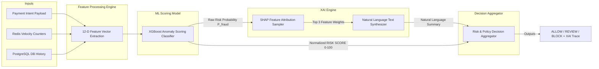

# AGENTPAY — 08: FRAUDGUARD Risk & XAI Architecture

## 1. Feature Extraction & Scoring Pipeline

FRAUDGUARD evaluates 12 real-time feature dimensions to output a normalized `RISK SCORE` (0-100) and SHAP feature attributions.

---

## 2. 12-Dimensional Risk Feature Array

1. `amount_z_score`: Standard deviation distance from historical agent 30-day mean.
2. `velocity_60s`: Intents submitted by agent in past 60 seconds.
3. `velocity_15m`: Distinct merchants targeted in past 15 minutes.
4. `merchant_trust_score`: Trust rating of domain/MID (0-100).
5. `category_risk_weight`: Baseline fraud weight for MCC.
6. `user_baseline_ratio`: Intent amount divided by human user average purchase size.
7. `agent_age_days`: Time elapsed since agent enrolment.
8. `historical_failure_rate`: Ratio of failed attempts for agent.
9. `off_hours_flag`: Intent creation during off-hours window.
10. `geo_mismatch_flag`: Discrepancy between request IP ASN and registered user country.
11. `context_length_delta`: Structural anomaly delta in context prompt length.
12. `behavioral_anomaly_score`: Vector distance from historical agent prompt embedding baseline.
