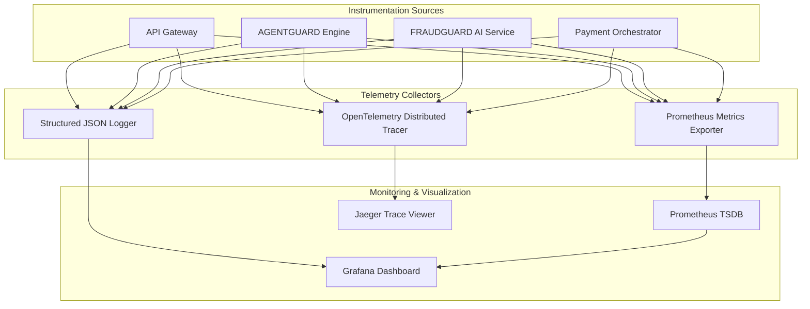

# AGENTPAY — 16: Structured JSON Logs, OpenTelemetry & Prometheus Tracing

## 1. Observability Architecture



---

## 2. Mandatory Correlation Identifiers

Every log entry and trace span includes seven correlation tags:

```text
trace_id       : OpenTelemetry W3C Distributed Trace Header
request_id     : API Edge Ingress Request UUID
transaction_id : Payment Intent UUID
agent_id       : AI Agent UUID
tenant_id      : User / Organization Owner UUID
payment_id     : Razorpay Payment ID
decision_id    : AGENTGUARD Authorization Decision UUID
```
