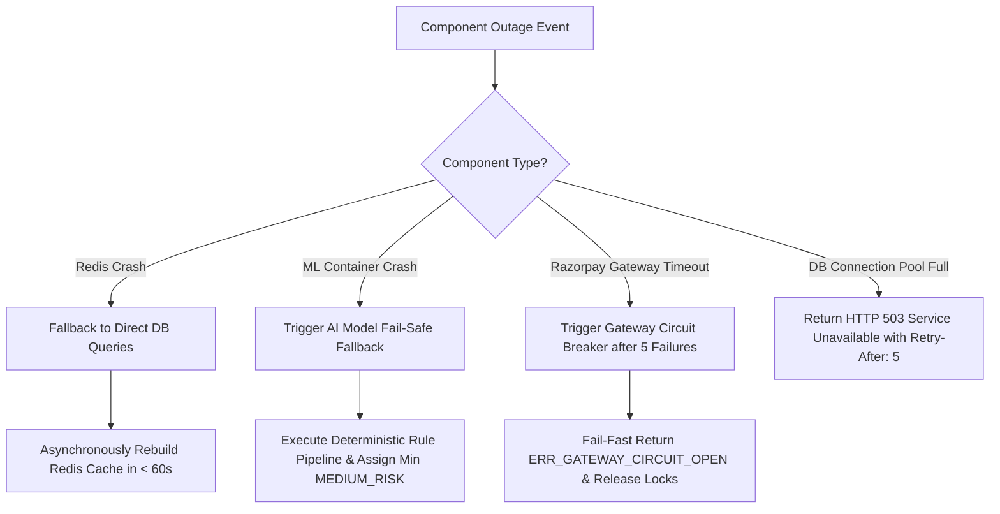

# AGENTPAY — 20: Component Outage Playbooks & Automatic Cache Recovery

## 1. Outage Recovery Playbook

---

## 2. Failure Playbook Procedures

### Playbook A: Redis Cache Outage
1. Gateway catches Redis connection timeout ($> 50\text{ ms}$).
2. Gateway switches policy lookups to direct PostgreSQL database queries.
3. System logs `WARN_REDIS_OUTAGE` and triggers cache container health check.
4. Upon Redis container recovery, background worker repopulates policy cache within $< 60\text{ seconds}$.

### Playbook B: FRAUDGUARD ML Container Crash
1. AGENTGUARD catches Python risk service connection error.
2. System triggers **AI Fail-Safe Fallback**: executes static deterministic rule pipeline.
3. System assigns minimum `MEDIUM_RISK` score, escalating ambiguous intents to human `REVIEW`.
4. System NEVER defaults to `ALLOW`. System logs `CRITICAL_AI_SERVICE_DOWN` alert.

### Playbook C: Razorpay Gateway Timeout / Outage
1. Payment Service detects 5 consecutive gateway timeouts ($> 5,000\text{ ms}$).
2. Circuit Breaker opens for 30 seconds; subsequent calls return `ERR_GATEWAY_CIRCUIT_OPEN`.
3. Inflight intent states remain safely in `AUTHORIZED` or transition to `FAILED` with balance lock release.
4. Circuit Breaker executes half-open trial check after 30 seconds.
