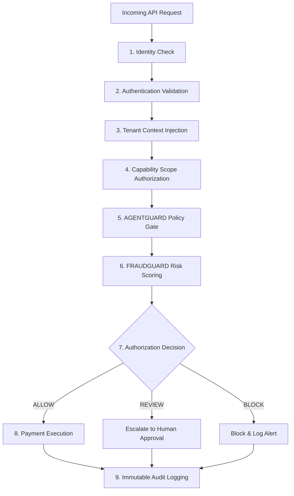

# AGENTPAY — 04: Zero-Trust Architecture & Continuous Verification

## 1. Zero-Trust Architecture Blueprint

---

## 2. Server-Side Context Verification

Every request must establish: **WHO** (User/Agent GUID), **WHAT** (Action/Scope), **WHY** (Task Intent Context), **WHERE** (IP/Geo), **WHEN** (Timestamp Window), **FOR WHICH TENANT** (`tenant_id`), **WITH WHAT RISK** (`risk_score`). Authorization decisions are rendered 100% server-side.
