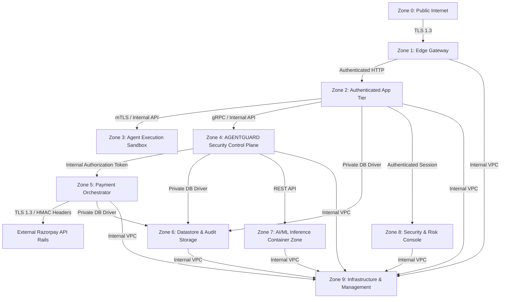

# AGENTPAY — 05: 10 Security Zones & Network Segmentation Matrix

## 1. Security Zone Definitions

---

## 2. Zone Communication Matrix

| Source Zone | Destination Zone | Protocol | Purpose | Access Rule |
| :--- | :--- | :--- | :--- | :--- |
| **Zone 0** (Internet) | **Zone 1** (Edge Gateway) | HTTPS / TLS 1.3 | Ingress Client / Agent API Requests | ALLOW (Rate Limited) |
| **Zone 1** (Gateway) | **Zone 2** (App Tier) | HTTP / Internal API | Ingress Request Forwarding | ALLOW (Authenticated Only) |
| **Zone 2** (App Tier) | **Zone 4** (AGENTGUARD) | gRPC / Internal REST| Policy Evaluation Trigger | ALLOW (Internal Network Only) |
| **Zone 4** (AGENTGUARD) | **Zone 5** (Payment) | Internal Token | Authorized Payment Execution Dispatch| ALLOW (Valid Auth Token Only) |
| **Zone 3** (Agent Exec) | **Zone 5** (Payment) | Direct HTTP | Direct Payment Execution Attempt | **DENY ALL** (Must route via Zone 4) |
| **Zone 0** (Internet) | **Zone 6** (Datastores) | Any | Direct Database Connection | **DENY ALL** |
