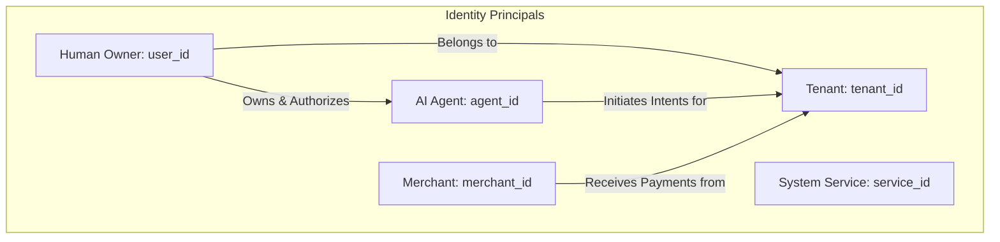

# AGENTPAY — 06: Identity Principals, GUIDs & Key Governance

## 1. Identity Principals Taxonomy

AGENTPAY treats human owners, AI agents, merchants, system services, and background workers as distinct, independently verifiable security principals.

---

## 2. Mandatory Identification Keys

* `tenant_id`: Unique organization/user workspace GUID (`tenant_7f8a...`).
* `user_id`: Unique human account owner GUID (`usr_91a0...`).
* `agent_id`: Unique AI agent principal GUID (`agt_8f9b...`).
* `merchant_id`: Unique merchant identification GUID (`mch_1234...`).
* `transaction_id`: Unique payment intent GUID (`intent_7f8a...`).
* `decision_id`: Unique AGENTGUARD authorization decision GUID (`dec_9f8a...`).
