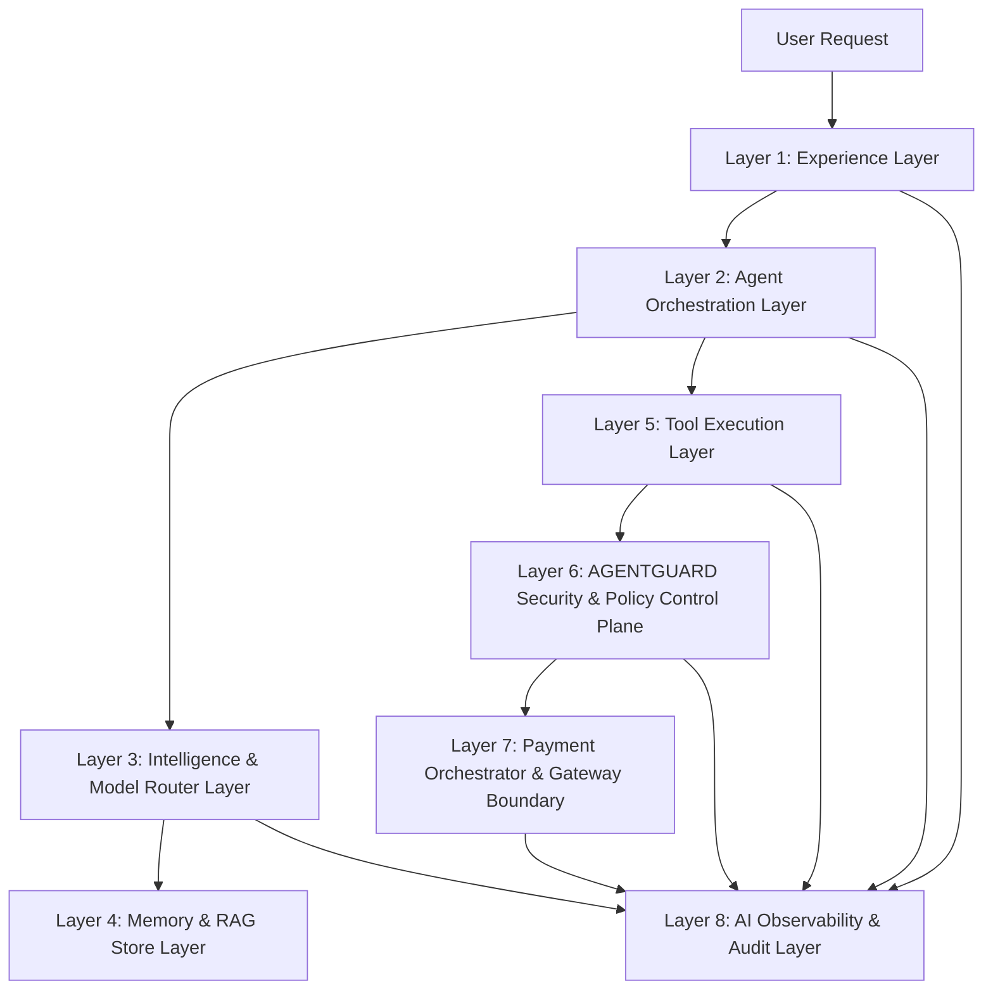

# AGENTPAY — 03: 8-Layer Logical AI Systems Architecture

## 1. Logical Pipeline

---

## 2. Layer Functions

* **Layer 1 (Experience)**: Web/Chat console, Approval Center, XAI decision traces.
* **Layer 2 (Orchestration)**: LangGraph state machine, Agent Registry, Task Scheduler.
* **Layer 3 (Intelligence)**: Model Router, OpenAI/Anthropic/Local LLM abstraction, Pydantic Schema validator.
* **Layer 4 (Memory)**: PostgreSQL + pgvector RAG, short-term session state, user preferences.
* **Layer 5 (Tools)**: Tool Registry, Product/Merchant search, Cart assembler.
* **Layer 6 (AGENTGUARD)**: 6-Stage Policy Engine, 12-D Feature extraction, XGBoost risk model, SHAP XAI engine.
* **Layer 7 (Payment)**: Payment Orchestrator, Razorpay adapter, State machine.
* **Layer 8 (Observability)**: OpenTelemetry traces, token usage monitoring, SHA-256 audit log chain.
