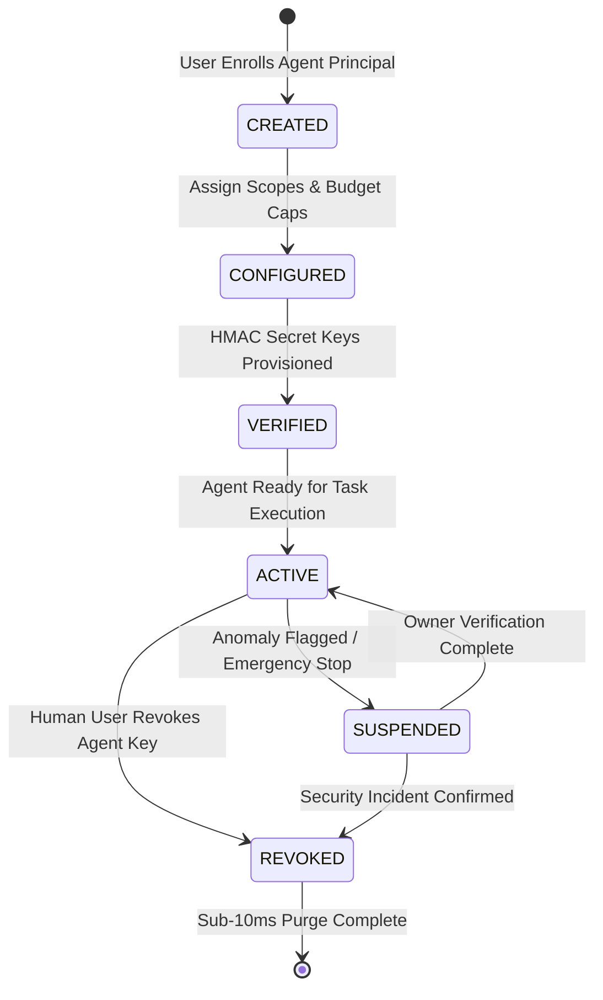

# AGENTPAY — 06: Agent Lifecycle State Machine

## 1. Lifecycle Diagram

---

## 2. State Transition Controls

* `CREATED` $\rightarrow$ `CONFIGURED`: Requires human user assignment of capability scopes (`spend:intent_create`) and daily budget caps.
* `ACTIVE` $\rightarrow$ `SUSPENDED`: Triggered automatically by AGENTGUARD on velocity breach ($> 5\text{ req/s}$) or high risk score ($> 90$).
* `ACTIVE` $\rightarrow$ `REVOKED`: Evicts Redis edge authentication keys in $< 10\text{ ms}$.
