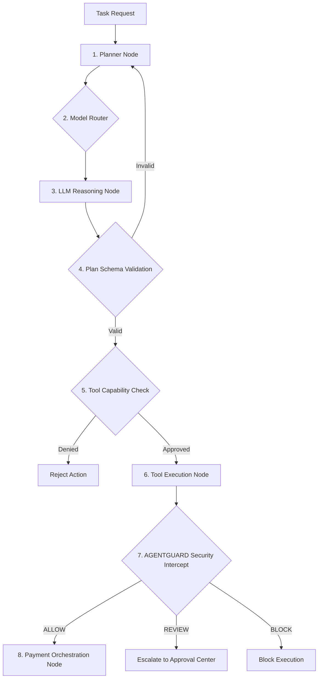

# AGENTPAY — 09: LangGraph / LangChain Agent Orchestration Engine

## 1. Orchestration Engine Blueprint

AGENTPAY uses LangGraph state machine graphs for deterministic agent orchestration.

---

## 2. Framework Isolation Rule

The orchestration framework (LangGraph) functions exclusively as a flow control mechanism. It possesses zero authority to grant policy permissions or execute payments directly. All financial authorization remains externalized in AGENTGUARD.
