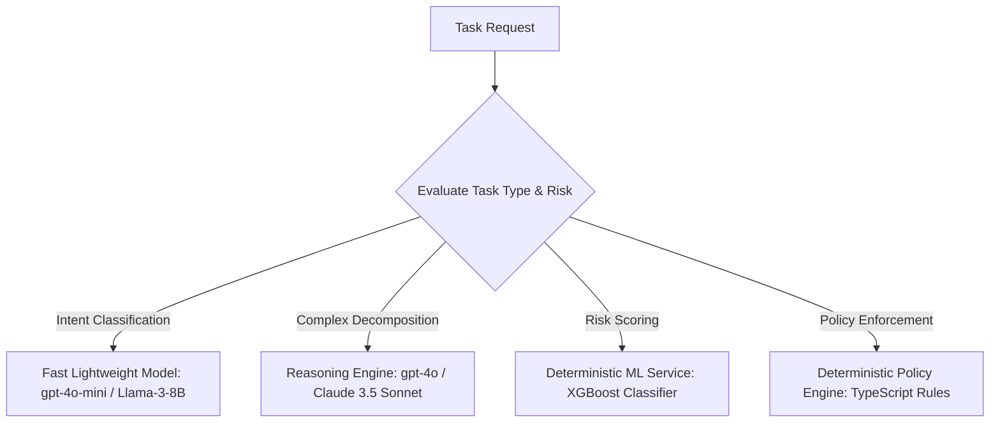

# AGENTPAY — 12: Dynamic Task-Based Model Router

## 1. Model Routing Architecture

The Model Router dynamically assigns tasks to optimal LLM / ML models based on complexity, latency SLAs, cost budgets, and risk thresholds.

---

## 2. Security Mandate

Deterministic policy enforcement and fraud scoring NEVER route to generative LLM models. Policy rules execute via TypeScript code; fraud scoring executes via XGBoost.
