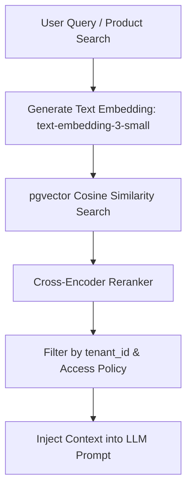

# AGENTPAY — 18: PostgreSQL + pgvector Hybrid RAG Pipeline Specifications

## 1. RAG Retrieval Pipeline

---

## 2. Document Metadata Schema

Every vector record stores structured security metadata: `{ "tenant_id": "tenant_123", "source_id": "doc_456", "trust_level": "EXTERNAL", "access_policy": "POLICY_PUBLIC" }`.
