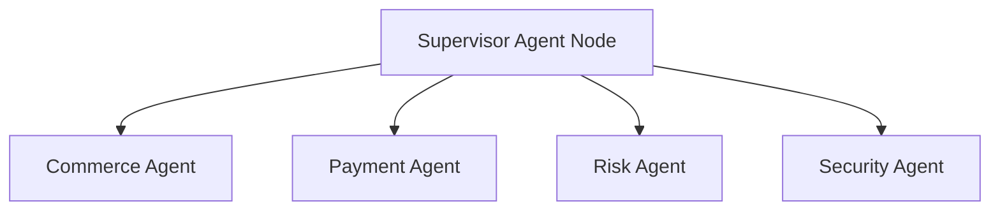

# AGENTPAY — 29: Hierarchical Supervisor-Worker Multi-Agent Orchestration

## 1. Multi-Agent Topology

---

## 2. Multi-Agent Security Isolation

Specialist workers communicate strictly through authenticated message channels overseen by the Supervisor Node. Workers cannot invoke other workers directly or share capability scope tokens.
