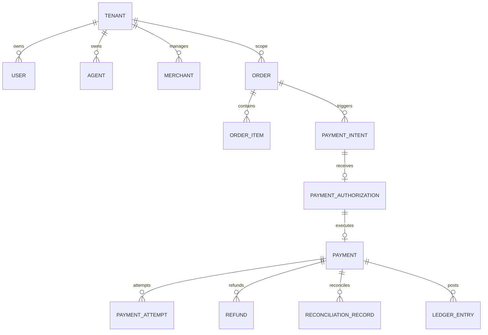

# AGENTPAY — 03: Payment Domain Model Entities & Tenant Ownership

## 1. Domain Entities Architecture

---

## 2. Mandatory Domain Entities

* **`Tenant`**: Multi-tenant workspace principal (`tenant_id`).
* **`User`**: Account owner GUID (`user_id`).
* **`Agent`**: Autonomous agent GUID (`agent_id`).
* **`Merchant`**: Payee merchant GUID (`merchant_id`).
* **`Order`**: Order header (`order_id`) containing purchased items.
* **`PaymentIntent`**: Proposed financial transaction payload (`payment_intent_id`).
* **`PaymentAuthorization`**: Signed short-lived authorization token (`authorization_id`).
* **`Payment`**: Core settlement record (`payment_id`).
* **`PaymentAttempt`**: Individual provider settlement attempt (`attempt_id`).
* **`Refund`**: Refund request header (`refund_id`).
* **`ReconciliationRecord`**: Settlement discrepancy reconciliation (`reconciliation_id`).
* **`LedgerEntry`**: Double-entry financial journal line (`ledger_entry_id`).
