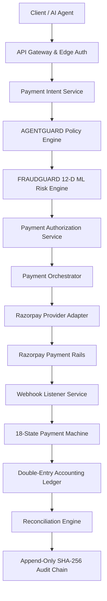

# AGENTPAY — 05: End-to-End Logical Payment Processing Architecture

## 1. System Processing Flow

---

## 2. Execution Principles

1. **Deterministic Interception**: The AI agent proposes the intent; AGENTGUARD evaluates policy caps; FRAUDGUARD evaluates ML risk scores.
2. **Authorized Settlement**: Payment Orchestrator dispatches execution to Razorpay strictly upon receiving a valid, signed `PaymentAuthorizationContext`.
