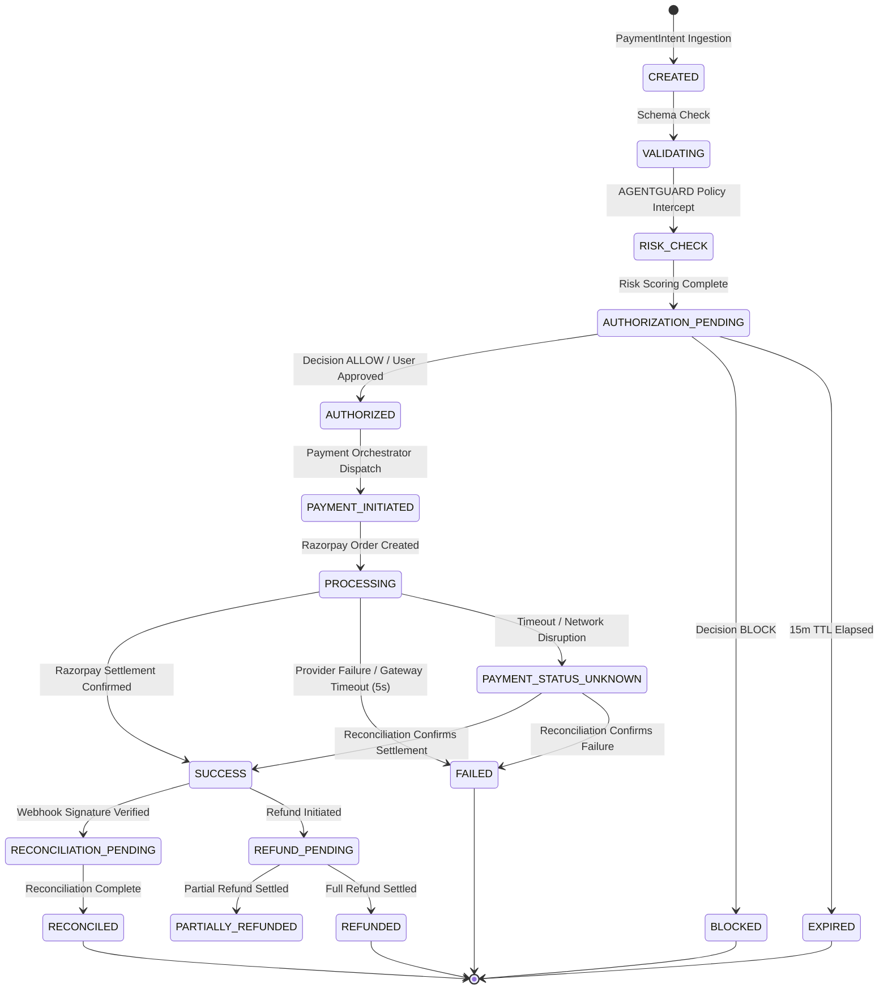

# AGENTPAY — 11: 18-State Payment Transaction State Machine

## 1. 18-State State Machine Diagram

```mermaid
stateDiagram-v2
    [*] --> CREATED: PaymentIntent Ingestion
    CREATED --> VALIDATING: Schema Check
    VALIDATING --> RISK_CHECK: AGENTGUARD Policy Intercept
    RISK_CHECK --> AUTHORIZATION_PENDING: Risk Scoring Complete
    AUTHORIZATION_PENDING --> AUTHORIZED: Decision ALLOW / User Approved
    AUTHORIZATION_PENDING --> BLOCKED: Decision BLOCK
    AUTHORIZATION_PENDING --> EXPIRED: 15m TTL Elapsed

    AUTHORIZED --> PAYMENT_INITIATED: Payment Orchestrator Dispatch
    PAYMENT_INITIATED --> PROCESSING: Razorpay Order Created
    PROCESSING --> SUCCESS: Razorpay Settlement Confirmed
    PROCESSING --> FAILED: Provider Failure / Gateway Timeout (5s)
    PROCESSING --> PAYMENT_STATUS_UNKNOWN: Timeout / Network Disruption

    PAYMENT_STATUS_UNKNOWN --> SUCCESS: Reconciliation Confirms Settlement
    PAYMENT_STATUS_UNKNOWN --> FAILED: Reconciliation Confirms Failure

    SUCCESS --> RECONCILIATION_PENDING: Webhook Signature Verified
    RECONCILIATION_PENDING --> RECONCILED: Reconciliation Complete
    SUCCESS --> REFUND_PENDING: Refund Initiated
    REFUND_PENDING --> PARTIALLY_REFUNDED: Partial Refund Settled
    REFUND_PENDING --> REFUNDED: Full Refund Settled

    BLOCKED --> [*]
    EXPIRED --> [*]
    FAILED --> [*]
    RECONCILED --> [*]
    REFUNDED --> [*]
```
