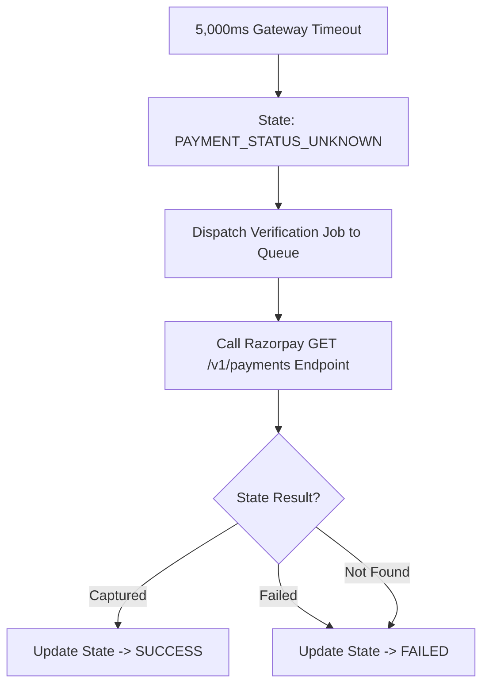

# AGENTPAY — 22: `PAYMENT_STATUS_UNKNOWN` Verification Protocol

## 1. State Resolution Workflow

When a payment timeout occurs, the intent state transitions to `PAYMENT_STATUS_UNKNOWN`:

```mermaid
graph TD
    TIMEOUT[5,000ms Gateway Timeout] --> UNKNOWN[State: PAYMENT_STATUS_UNKNOWN]
    UNKNOWN --> DISPATCH[Dispatch Verification Job to Queue]
    DISPATCH --> GET_API[Call Razorpay GET /v1/payments Endpoint]
    GET_API --> RES{State Result?}
    RES -- Captured --> SET_SUCCESS[Update State -> SUCCESS]
    RES -- Failed --> SET_FAILED[Update State -> FAILED]
    RES -- Not Found --> SET_FAILED
```
