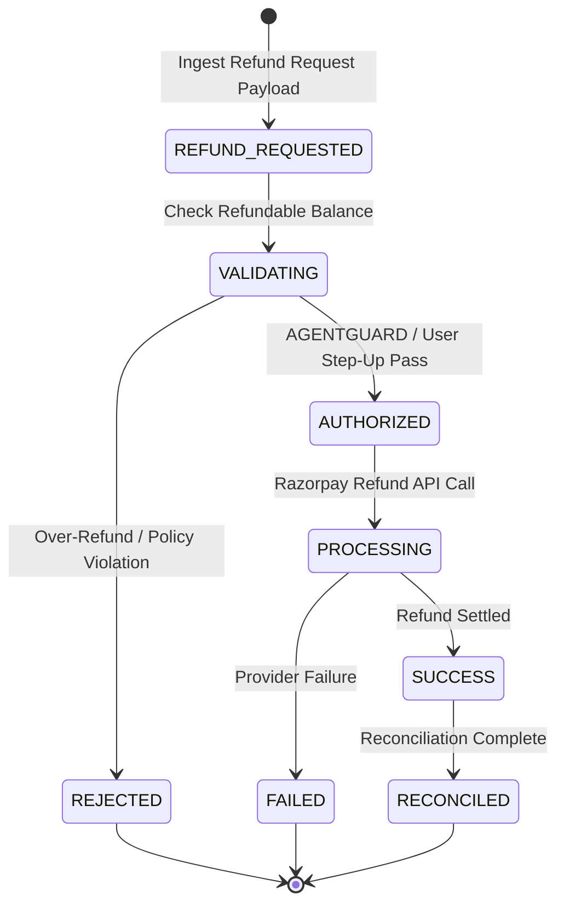

# AGENTPAY — 28: 8-State Refund Lifecycle State Machine

## 1. Refund State Diagram

```mermaid
stateDiagram-v2
    [*] --> REFUND_REQUESTED: Ingest Refund Request Payload
    REFUND_REQUESTED --> VALIDATING: Check Refundable Balance
    VALIDATING --> AUTHORIZED: AGENTGUARD / User Step-Up Pass
    VALIDATING --> REJECTED: Over-Refund / Policy Violation
    AUTHORIZED --> PROCESSING: Razorpay Refund API Call
    PROCESSING --> SUCCESS: Refund Settled
    PROCESSING --> FAILED: Provider Failure
    SUCCESS --> RECONCILED: Reconciliation Complete
    REJECTED --> [*]
    FAILED --> [*]
    RECONCILED --> [*]
```
