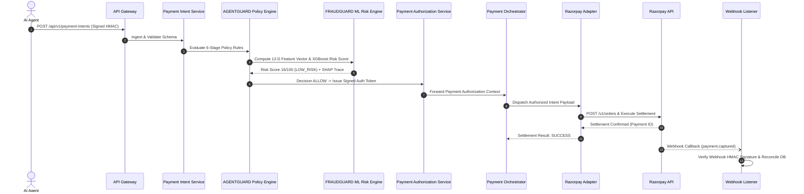

# AGENTPAY — 38: End-to-End Autonomous Agent Payment Step Execution

## 1. Complete Autonomous Payment Flow

```mermaid
sequenceDiagram
    autonumber
    actor Agent as AI Agent
    participant GW as API Gateway
    participant Intent as Payment Intent Service
    participant Guard as AGENTGUARD Policy Engine
    participant Fraud as FRAUDGUARD ML Risk Engine
    participant Auth as Payment Authorization Service
    participant Orch as Payment Orchestrator
    participant Adapter as Razorpay Adapter
    participant Razorpay as Razorpay API
    participant Webhook as Webhook Listener

    Agent->>GW: POST /api/v1/payment-intents (Signed HMAC)
    GW->>Intent: Ingest & Validate Schema
    Intent->>Guard: Evaluate 6-Stage Policy Rules
    Guard->>Fraud: Compute 12-D Feature Vector & XGBoost Risk Score
    Fraud-->>Guard: Risk Score 16/100 (LOW_RISK) + SHAP Trace
    Guard->>Auth: Decision ALLOW -> Issue Signed Auth Token
    Auth->>Orch: Forward Payment Authorization Context
    Orch->>Adapter: Dispatch Authorized Intent Payload
    Adapter->>Razorpay: POST /v1/orders & Execute Settlement
    Razorpay-->>Adapter: Settlement Confirmed (Payment ID)
    Adapter-->>Orch: Settlement Result: SUCCESS
    Razorpay--)Webhook: Webhook Callback (payment.captured)
    Webhook->>Webhook: Verify Webhook HMAC Signature & Reconcile DB
```
