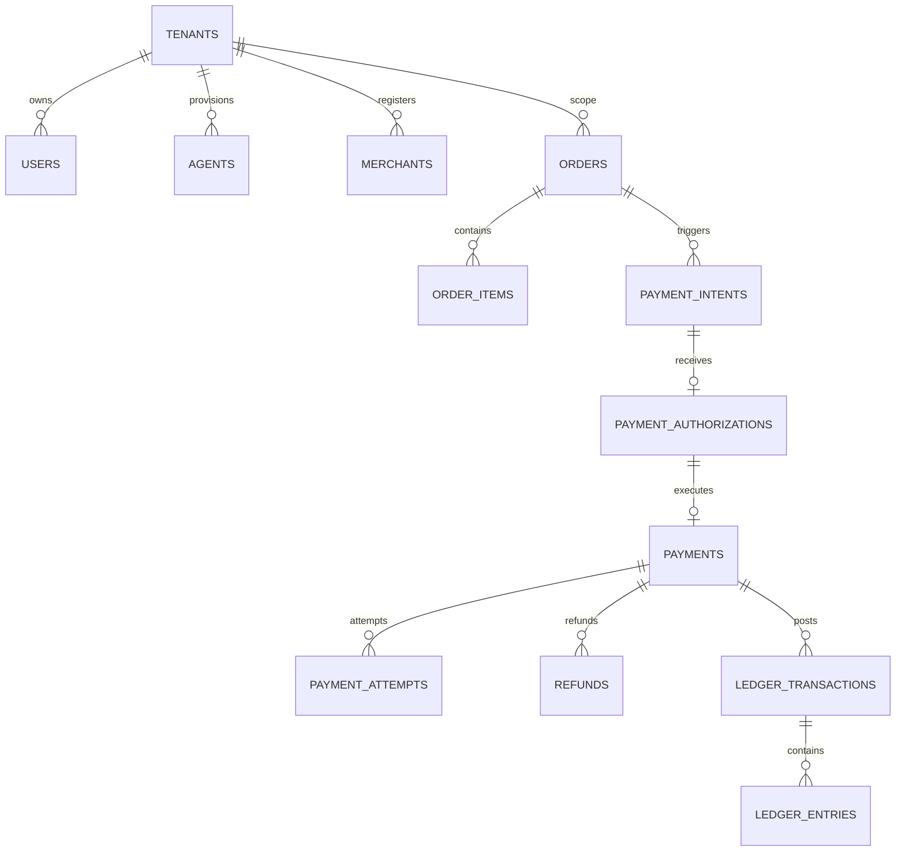

# AGENTPAY — 05: Complete Relational Entity Model & Schema Inter-Relationships

## 1. Relational Entity Relationship Diagram

---

## 2. Inviolable Schema Principles

* **Cascading Tenant Scope**: Every single relational record links to a `tenant_id`.
* **Restricted Deletions**: Deletions are forbidden on financial tables (`ON DELETE RESTRICT`).
