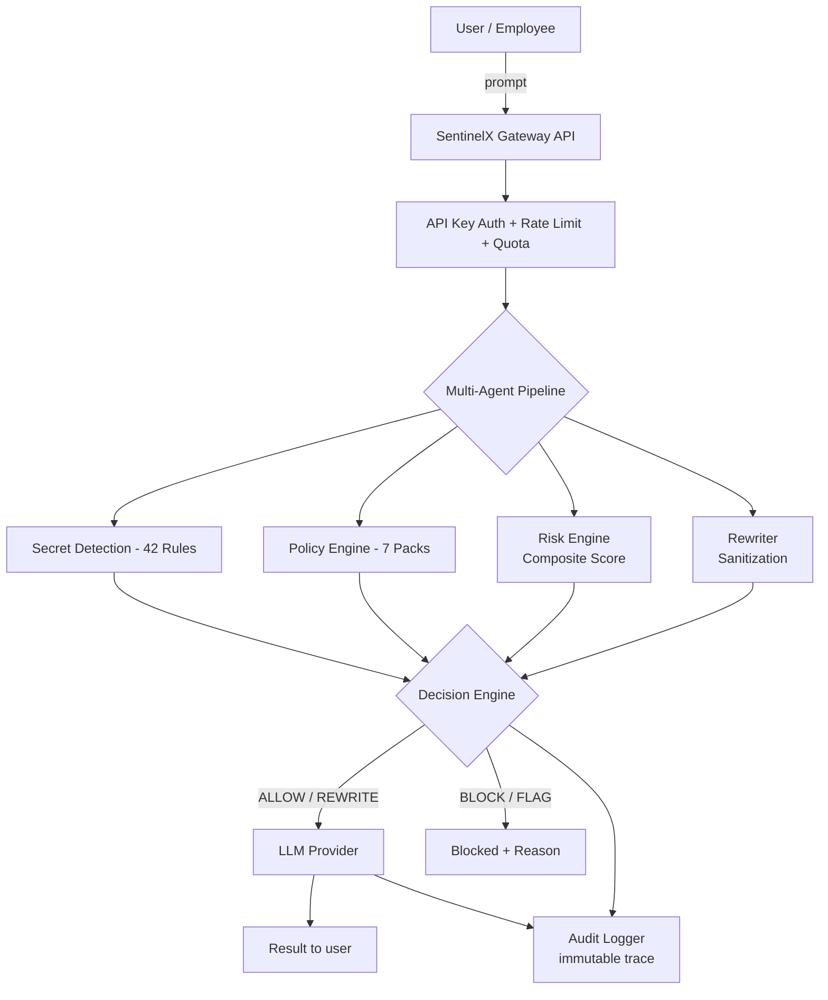

<div align="center">
  <br />
  <h1>Shadow AI Leak Detector <br />(SentinelX)</h1>
  <p>
    <strong>Every prompt. Every model. Zero secrets leaking.</strong>
  </p>
  
  <p>
    An AI security gateway that intercepts prompts before they reach any LLM, detects secrets & PII with a multi-agent pipeline, enforces regulatory policy, scores composite risk, and blocks, rewrites, or allows each request — with a live, immutable audit trail.
  </p>

  <p>
    <a href="https://www.typescriptlang.org"></a>
    <a href="https://nextjs.org"></a>
    <a href="https://fastify.dev"></a>
    <a href="https://react.dev"></a>
    <a href="https://tailwindcss.com"></a>
    <a href="https://www.postgresql.org"></a>
    <a href="LICENSE"></a>
  </p>
</div>

---

## 🎬 Product Demo

Watch SentinelX intercept a live attack sequence: AWS key → JWT → HR database → credit card → source code → patient record. Each threat is detected, scored, and neutralized by the agent pipeline in real time.

https://github.com/Manthan-13521/SentinelX-AI-Governance-Firewall/raw/main/assets/demo.mp4

> **Note:** If the video player doesn't render above, you can [download or watch the raw MP4 here](assets/demo.mp4) (1 minute 36 seconds).

---

## 🚨 The Problem

**Shadow AI is the data breach nobody sees coming.**

- 🙈 **Employees are leaking data.** Secrets, source code, customer PII, patient records, and credentials get pasted into public LLM chat interfaces every day — outside any corporate firewall.
- 🕳️ **Security teams lack visibility** at the AI boundary. Traditional DLP secures stored files; nothing secures the live LLM conversation.
- 🏛️ **Regulators are catching up.** GDPR, HIPAA, PCI DSS, SOC 2, and ISO 27001 demand *demonstrable* control over where regulated data flows.
- 💸 **Breaches are expensive.** One leaked credential or patient record can mean a severe fine, a lawsuit, or front-page news.
- 🛑 **Blocking AI doesn't work.** It just creates shadow IT. The winning move is governance, not prohibition.

## 💡 The Solution

SentinelX sits **between employees and the models** as an intelligent security gateway for all AI traffic. 

Every single prompt is:
1. **Intercepted** before it reaches any LLM provider.
2. **Analyzed** by an 8-agent pipeline for secrets, policy enforcement, and risk.
3. **Scored** against 42 detection rules and 7 regulatory/corporate policy packs (GDPR, HIPAA, PCI DSS, SOC 2, ISO 27001, Internal, Secrets).
4. **Decided** upon at the boundary: `ALLOW` · `REWRITE` · `BLOCK` · `FLAG`.
5. **Audited** with every decision explained and recorded in an immutable trace.

The result: employees keep using AI productively, and sensitive data never reaches a third-party model.

## ✨ Key Features

| Capability | Details |
| --- | --- |
| 🛡️ **AI Security Gateway** | OpenAI-compatible `POST /v1/chat/completions` — API-key auth, quota, rate limits, budgets, concurrency, model routing, failover. |
| 🤖 **8-Agent Pipeline** | Inspector, Secret Detection, Policy Engine, Risk Engine, Rewriter, LLM Adapter, Audit Logger, Memory. |
| 🔍 **42 Detection Rules** | AWS keys, JWTs, credit cards (Luhn-validated), credentials, PII, PHI, API keys, source code. |
| 📋 **7 Policy Packs** | GDPR, HIPAA, PCI DSS, SOC 2, ISO 27001, Internal, Secrets. |
| 📊 **Executive Command Center** | Security score, maturity gauge, compliance status, financial exposure, risk forecasts. |
| 🎯 **Mission Control (SOC)** | Global threat map, live attack stream, incident queue, pipeline throughput. |
| 🧬 **Digital Twin** | Interactive per-department risk graph (HR · Finance · Engineering · Legal · Sales · Ops) + security DNA. |
| 🧠 **Explainability Center** | Decision graph, agent contributions, reasoning timeline, confidence per decision. |
| 📈 **Enterprise Analytics** | 15 charts — risk forecast, incident heatmap, policy effectiveness, detection accuracy. |
| 🤝 **Security Copilot** | Executive assistant grounded in live telemetry, with session memory. |
| 🔐 **RBAC & Governance** | 7 granular roles across the platform. |

## 🏗️ Architecture



### Two Workspaces, Shared Model:
- **`apps/api` (The Security Core)**: A Fastify server exposing the OpenAI-compatible gateway (`/v1/chat/completions`), the full agent pipeline, policy/risk/rewrite engines, model routing with provider failover, and a store facade (in-memory by default, Prisma → PostgreSQL for production).
- **`apps/web` (The Control Plane)**: A Next.js 16 app (App Router, React 19, Tailwind v4) with executive dashboards, SOC, compliance, analytics, explainability, copilot, and the demo judging experience.

## 🛡️ Security Model

- **Detection-first** — 42 secret/PII patterns plus prompt-injection and jailbreak classification on every request.
- **Output by default** — in-memory demo mode requires zero secrets (no DB, no API keys).
- **Policy enforcement** — quota, rate limits, daily/monthly token & budget caps, concurrency limits.
- **Redaction** — `REWRITE` sanitizes prompts, keeping intent while stripping sensitive content.
- **Audit integrity** — every decision is recorded with prompt hash, risk score, provider, cost, and agent trace.

## 🔗 SentinelX Gateway Integration

The repository is designed to run behind **SentinelX** as the enforced boundary:

- `SENTINELX_BASE_URL` — the gateway's OpenAI-compatible base URL.
- `SENTINELX_API_KEY` — the gateway credential used when routing traffic.

When set, the API routes outbound LLM calls through the SentinelX gateway, which applies its own security, policy, and risk pipeline.

## 🧰 Tech Stack

- **Backend**: Fastify 5 · TypeScript · Prisma · Socket.io · Sentry · PostHog
- **Frontend**: Next.js 16 (App Router) · React 19 · Tailwind CSS v4 · Recharts · Framer Motion · Radix UI
- **Data**: PostgreSQL · Redis (optional) · In-memory demo store
- **AI**: 8-agent pipeline · 42 detection rules · 5 LLM providers + OpenRouter failover
- **Quality**: Strict typecheck · Node test runner suites

## 📁 Project Structure

```
├── apps/
│   ├── api/                 # Fastify security gateway (the enforcement core)
│   └── web/                # Next.js control-plane dashboard
├── assets/demo.mp4         # 1:36 product demo video
├── docs/                   # Architecture, security model, API reference
├── tests/                  # Node test-runner suites
├── railway.toml            # Railway deployment config
├── vercel.json             # Vercel deployment config
└── LICENSE                 # MIT License
```

## 🚀 Getting Started

```bash
# API — port 3001 (demo mode, no config required)
cd apps/api
npm install
npm run dev            # boots inline demo mode

# Web — port 3000 (second terminal)
cd apps/web
npm install
npm run dev
```

Open **http://localhost:3000**, sign in, and go to **Demo Mode** → **▶ Judge Mode** to watch the automatic attack sequence.

### Health Check
```bash
curl http://localhost:3001/api/health
```

### Gateway Testing (OpenAI-compatible)
```bash
curl -X POST http://localhost:3001/v1/chat/completions \
  -H "Authorization: Bearer <your-api-key>" \
  -H "Content-Type: application/json" \
  -d '{"model":"sentinel-auto","messages":[{"role":"user","content":"hello"}]}'
```

## ⚙️ Environment Variables

All values are optional for demo mode. Provide **names only**; no secrets live here.

- `SENTINELX_BASE_URL` / `SENTINELX_API_KEY`
- `OPENAI_API_KEY` / `OPENROUTER_API_KEY` / `GEMINI_API_KEY` / `ANTHROPIC_API_KEY`
- `DATABASE_URL` / `REDIS_URL`
- `NEXT_PUBLIC_API_URL`
*(See `.env.example` in `apps/api` and `apps/web` for full list)*

## 🧪 Testing

The repository ships a comprehensive Node **test-runner suite** under `tests/`:

```bash
cd tests
node --test tests/api/*.test.mjs        # API / contract
node --test tests/auth/*.test.mjs       # RBAC
node --test tests/security/*.test.mjs   # attacks, fuzzing
node --test tests/regression/*.test.mjs # full user journeys
node --test tests/load/*.test.mjs       # rate/load profile
```

## 🚢 Deployment

- **Web**: Verified on Vercel (`apps/web` with `vercel.json`).
- **API**: Railway via `railway.toml` (nixpacks) or Docker (`Dockerfile`).

## 🗺️ Roadmap

- **Guardrails-as-code**: Policy packs versioned in Git.
- **On-device detection**: Local PII embedding without sending data.
- **Agent-to-agent guardrails**: Govern AI talking to AI.
- **Browser extension**: Enforce policy at the paste point.

## 📄 License

MIT — see [LICENSE](LICENSE).